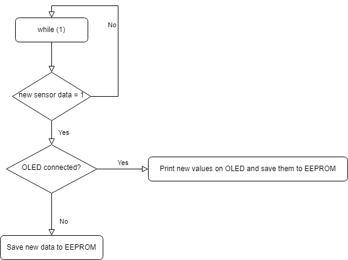

# Smart Plant Watering System Firmware Documentation

## Overview
The Smart Plant Watering System firmware facilitates automated plant care by monitoring soil moisture levels, displaying real-time data on an OLED screen, and controlling watering based on predefined thresholds. This documentation aims to explain the code structure, functionalities, and hardware interactions.

## Members:
- **Roman Křivánek** ID: 240642
- **Filip Frey** ID: 240233
- **Michal Papaj** ID: 240408

## Hardware Used
- **Arduino Uno R3**
- **Capacitive Moisture Sensor V1.2** (or replaceable with a resistance moisture sensor; initial values and one percent value must be recalibrated accordingly)
- **DHT12 Humidity and Temperature Sensor**
- **DS3231 RTC Module** with attached EEPROM memory chip
- **5V Relay Module** or 5V DC Pump (max 20mA current)

## Software Used
- **Visual Studio Code** with PlatformIO extension
- **C Programming Language**
- **Headers and Example Code** sourced from DE2 lectures ([DE2 lectures](https://github.com/tomas-fryza/digital-electronics-2/tree/master/solutions))

## File Structure
### Source Files
- `main.c`: Main functionality of the Smart Plant Watering System.
### Library Files
- `gpio.c`: GPIO pin handling functions.
- `gpio.h`: Header file for GPIO pin handling functions.
- `font.h`: Header file for OLED font-related functionalities.
- `oled.c`: Functions for OLED display control.
- `oled.h`: Header file for OLED display control functions.
- `RTC.c`: Implementation file for Real-Time Clock functionalities.
- `twi.c`: TWI (Two-Wire Interface) functionalities.
- `twi.h`: Header file for TWI functionalities.
- `timer.h`: Custom library for timer configurations.
- `uart.c`: UART (Universal Asynchronous Receiver-Transmitter) operations.
- `uart.h`: Header file for UART operations.


## Functionalities
### Initialization
- Initializes TWI, UART, ADC, and GPIO pins.
- Checks connectivity with the OLED display and presents a boot screen if connected.
### Sensor Readings
- Utilizes TWI to acquire temperature and humidity data from the DHT12 sensor.
- Retrieves time data from the Real-Time Clock (RTC, DS3231) using TWI.
### Moisture Monitoring
- Utilizes ADC for reading soil moisture and computes the percentage of moisture.
### Plant Watering Logic
- Controls the relay based on preset moisture thresholds.
- Indication LEDs (Red, Green, Blue) reflect the current soil moisture level.
### Data Storage
- Saves sensor data (time, temperature, moisture) into the RTC's EEPROM memory.
### User Interaction
- Displays real-time data (time, temperature, moisture) on the OLED screen.
- Allows exporting stored data via UART to a serial monitor upon button press.

## Hardware Configuration
### I/O Pin Configuration
- Soil Moisture Sensor: Connected to ADC0 - arduino pin A0.
- LEDs: Red (PB1), Green (PB2), Blue (PB3) - arduino pins D9,D10,D11.
- Water Pump Relay: Connected to PB0 - arduino pin D8.
- Button for Data Export: Connected to PB4 - arduino pin D12.
  
  
  
### Communication Interfaces
- TWI (Two-Wire Interface): Used for communication with OLED, DHT12 sensor, and RTC.
- UART (Universal Asynchronous Receiver-Transmitter): Configured for serial communication.

## Interrupts
- `TIMER1` Overflow Interrupt: Triggers periodic sensor readings (temperature, humidity, time) and sets flags for new data.
- `ADC` Conversion Complete Interrupt: Captures soil moisture data for percentage calculation.

## Usage
### Setup
- Connect hardware components based on the provided pin configurations.
- Flash the firmware onto the microcontroller.
### Operation
- Power on the system.
- The OLED displays real-time information about temperature, time, and moisture levels.
- LEDs indicate the current moisture status.
- Press the button to export stored data via the UART interface.
### Maintenance
- Adjust moisture threshold values (WaterValue, AirValue) for accurate watering control.
- Ensure correct connections and power supply to all components.

## Source Code
### Main Functionality (`main.c`)
- The `main()` function orchestrates system initialization, sensor readings, moisture calculations, control logic, and user interactions.

#### Soil moisture reading
```
// Including needed libraries
#include <avr/io.h>
#include <stdlib.h>
#include <gpio.h>
  
// variable for voltage conversion of moisture humidity
uint16_t mois_int; 
// Normal values of moisture sensor
const uint16_t AirValue = 950;   
const uint16_t WaterValue = 650; 
// Variable for conversion of moisture sensor data to percentual value
const int onePercent = 3;
uint8_t percentualValue;
uint16_t calculus;
#define soil PC0

// Configure Analog-to-Digital Convertion unit
// Select input channel ADC0 (voltage divider pin)
ADMUX = ADMUX & ~(1<<MUX3 | 1<<MUX2 | 1<<MUX1 | 1<<MUX0);
// Enable ADC module
ADCSRA = ADCSRA | (1<<ADEN);
// Enable conversion complete interrupt
ADCSRA = ADCSRA | (1<<ADIE);
// Set clock prescaler to 128
ADCSRA = ADCSRA | (1<<ADPS2 | 1<<ADPS1 | 1<<ADPS0);

// Conversion of the value from the plant's moisture sensor into percentages
calculus = (mois_int - WaterValue);
calculus = calculus/onePercent;
percentualValue = 100-calculus;

// Determine if the watering system is running or not based on percentual moisture
//low moisture, turning on the pump
if (percentualValue<30){ 
    GPIO_write_high(&PORTB, LED_RED);
    GPIO_write_low(&PORTB, LED_GREEN);
    GPIO_write_low(&PORTB, LED_BLUE);
    GPIO_write_low(&PORTB, RELAY); // starting pump
}
//moisture in range, will not change pump status, so it can water from 30% to 60% or dry from 60% to 30%
else if(percentualValue<60){ 
    GPIO_write_high(&PORTB, LED_BLUE);
    GPIO_write_low(&PORTB, LED_RED);
    GPIO_write_low(&PORTB, LED_GREEN);
}
//moisture is high, turning off the pump 
else if(percentualValue>=60){
    GPIO_write_high(&PORTB, LED_GREEN);
    GPIO_write_low(&PORTB, LED_RED);
    GPIO_write_low(&PORTB, LED_BLUE);
    GPIO_write_high(&PORTB, RELAY); //turning off pump
}

// Activating of reading Voltage value of pin PC0- arduinos A0
ADCSRA = ADCSRA | (1<<ADSC);
ISR(ADC_vect)
{
    // Note that, register pair ADCH and ADCL can be read as a 16-bit value ADC
    mois_int = ADC;
}

```

#### Temperature reading
```
#include <oled.h>
#include <twi.h>
#include <twi.h>
#include <uart.h>

/* Global variables --------------------------------------------------*/
// Declaration of "dht12" variable with structure "DHT_values_structure"
struct Values_structure {
   uint8_t hum_int;
   uint8_t hum_dec;
   uint8_t temp_int;
   uint8_t temp_dec;
} dht12;

// Slave and internal addresses of temperature/humidity sensor DHT12
#define SENSOR_ADR 0x5c
#define SENSOR_TEMP_MEM 2

// Test ACK from sensor
twi_start();
// Temperature and humidity sensor
if (twi_write((SENSOR_ADR<<1) | TWI_WRITE) == 0) {
    // Set internal memory location
    twi_write(SENSOR_TEMP_MEM);
    twi_stop();
    // Read data from internal memory
    twi_start();
    twi_write((SENSOR_ADR<<1) | TWI_READ);
    dht12.temp_int = twi_read(TWI_ACK);
    dht12.temp_dec = twi_read(TWI_NACK);
}
twi_stop();
```

#### Time reading
```
// Read Time from RTC DS3231; SLA = 0x68
// Test ACK from RTC
twi_start();
if (twi_write((RTC_ADR<<1) | TWI_WRITE) == 0) {
    // Set internal memory location
    twi_write(SECONDS_REG);
    twi_stop();
    // Read data from internal memory
    twi_start();
    twi_write((RTC_ADR<<1) | TWI_READ);
    rtc.secs = twi_read(TWI_ACK);
    rtc.mins = twi_read(TWI_ACK);
    rtc.hours = twi_read(TWI_NACK);
    new_sensor_data = 1;
}
twi_stop();
```

#### OLED printing
```
// Set all obtained data to be displayed on OLED
if(twi_test_address(OLED_ADR) == 0){
    // Display time from RTC
    // mask and diveded by 16 for making it the upper half of byte and only 2 bits used for tens of hours 10-60
    writeDataToOLED((rtc.hours& 0b00110000)/16,0,0);
    // mask for counting 0-16, 4 bits used for hours 0-9 
    writeDataToOLED(rtc.hours& 0b00001111,1,0); 
    oled_gotoxy(2, 0);
    oled_puts(":");
    writeDataToOLED((rtc.mins& 0b01110000)/16,3,0); 
    writeDataToOLED(rtc.mins& 0b00001111,4,0);
    oled_gotoxy(5, 0);
    oled_puts(":");
    writeDataToOLED((rtc.secs& 0b01110000)/16,6,0);
    writeDataToOLED(rtc.secs& 0b00001111,7,0);
    // Display temperature from temperature sensor
    if (twi_test_address(SENSOR_ADR) == 0){
        writeDataToOLED(dht12.temp_int,0,2);
        oled_gotoxy(2, 2);
        oled_puts(".");
        writeDataToOLED(dht12.temp_dec,3,2);
        oled_gotoxy(4, 2);
        oled_puts(" ");
        oled_putc((char)247); // degree symbol
        oled_puts("C");
    }
    // Display plant's moisture percentage
    writeDataToOLED(percentualValue,0,4);
    oled_gotoxy(3, 4);
    oled_puts("%");
    oled_gotoxy(0, 6);
    if (percentualValue<30){
        oled_puts("Dry");
    }
    else if(percentualValue<60){
        oled_puts("Wet");   
    }
    else if(percentualValue>=60){
        oled_puts("Watered");
    }
}
// Display all set data on OLED
oled_display();
```

#### Data logging to EEPROM
```
// Save current data to RTC's EEPROM
currentAddress = saveDataToRtcEeprom(rtc.hours, rtc.mins, rtc.secs, dht12.temp_int,dht12.temp_dec,mois_int);
uint16_t numoflogs = currentAddress/6; // devided by number of saved bytes per 1 saving
```

#### Data printing from EEPROM
```
if(!(PINB & (1 << BUTTON))) {
    button_was_pressed = 1;       
}

// inside if new sensor data
// If the button was pressed then display the stored data in serial monitor (data EXPORT)
if(button_was_pressed == 1){
    writeDataToUART(numoflogs, " total number of logs", 0,1);
    for (uint16_t i = 0; i < numoflogs; i++){
        writeDataToUART(i+1, ". log Time : ",0,0);
        writeDataToUART((eeprom_read_byte(0+i*6) & 0b00110000)/16, "", 0, 0);
        writeDataToUART(eeprom_read_byte(0+i*6) & 0b00001111, ":" , 0, 0);
        writeDataToUART((eeprom_read_byte(1+i*6) & 0b01110000)/16, "" , 0, 0);
        writeDataToUART(eeprom_read_byte(1+i*6) & 0b00001111, ":" , 0, 0);
        writeDataToUART((eeprom_read_byte(2+i*6) & 0b01110000)/16, "" , 0, 0);
        writeDataToUART(eeprom_read_byte(2+i*6) & 0b00001111, " Temperature : " , 0, 0);
        writeDataToUART(eeprom_read_byte(3+i*6), "." , 0, 0);  //temperature
        writeDataToUART(eeprom_read_byte(4+i*6), " °C Moisture : " , 0, 0);
        writeDataToUART(eeprom_read_byte(5+i*6), " ", 0, 1);
    }
    uart_puts("That's all the data !");
    uart_puts("\r\n");
    button_was_pressed = 0;
    }
```
#### Setting time to RTC DS3231
```
// main.c
writeTimeToDS3231(0x00,0x00,0x23,4,30,11,2023);
// lib/twi/RTC.c
```    
## Notes
- Ensure accurate connections and a stable power supply to prevent sensor malfunction.
- Modify moisture threshold values carefully for optimal plant care.
